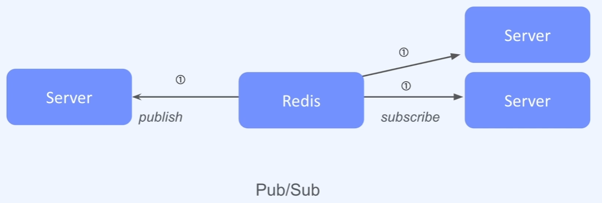
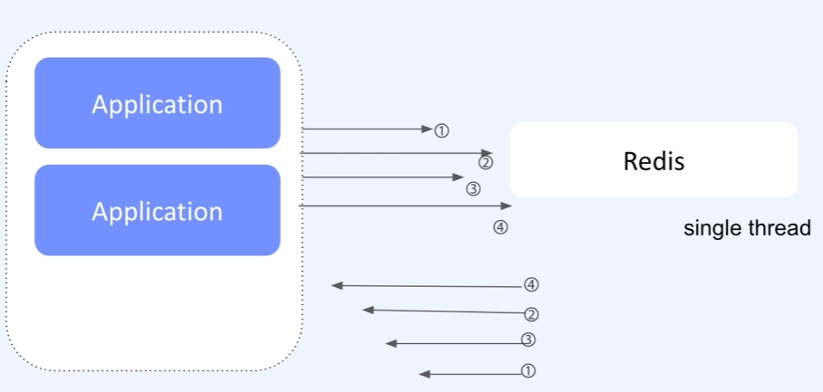

# Redis (Remote Dictionary Server)

### in-memory database key-value

1. Millisecond response (1ms = 0.001s)
2. Volatility of RAM
3. Data types
    1. String

    - 가장 기본 타입으로 text, byte를 저장
    - 증가 감소에 대한 원자적 연산

    2. Lists
    3. Sets
    4. Sorted sets
    5. Hashes
    6. Geospatial
    7. Bitmap

### 주요 특징

1. CPU
2. Memory
3. Disk

### 오픈 소스

1. Memcached
    1. Cache
2. Redis
    1. Cache
    2. Session STore
    3. Pub/Sub
       
    4. Leader board
    5. Geospatial

### Persistent on Dist

1. RDB(Snapshot) :: redis database
2. AOF(Append Only File)

### Single Thread

### command

- SET :: SET users:1:email email@email.com
- SETNX
- GET :: GET users:1:email
- MGET :: MGET users:1:email name
- INC :: INCR counter, INCRBY counter 10
- DEC

### TTL (Time To Live)

- EXPIRE [KEY] [SECOND]
    - SET LANG java
    - EXPIRE LANG 10 (10초 뒤에 만료)
    - TTL LANG

- DEL command (sync)
    - SET users:name jack
    - GET users:name
    - DEL users:name
    - GET users:name

- UNLINK command (async)
    - SET users:name jack
    - GET users:name
    - UNLINK users:name
    - GET users:name

- MEMORY USAGE command
    - MEMORY USAGE users:name
 